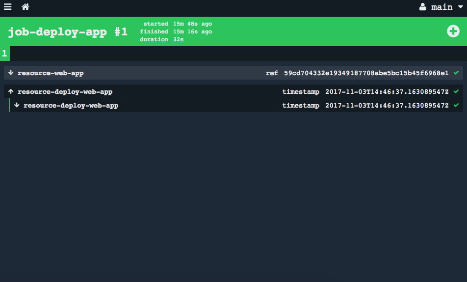

# Simple website deployed to Cloud Foundry via Concourse

This is an example of a simple website that you can host on your cloud foundry environment, using Concourse for automated deployments.  Just check in your code and let Concourse take care of the rest.

## Prerequisites:
1. A Cloud Foundry environment you can use
2. A Concourse environment you can use
3. The Concourse Fly CLI installed.  You can install from your concourse home page, see the icons in the lower right corner.


## Try it!

1. Fork the repo to your own github account

2. Clone the repo to your workstation

```
cd
git clone https://github.com/YOUR-GITHUB-ACCOUNT/website-demo
cd website-demo
```

3. Edit the pipeline.yml file, and replace `mjeffries-pivotal` with YOUR-GITHUB-ACCOUNT under the `resource-web-app` resource.  Also note that the pipeline has 2 resources, one for github, and one for Cloud Foundry.  There is one job (`job-deploy-app`) which uses the resources to get your latest website content and deploy it to Cloud Foundry.

```
---
resources:
- name: resource-web-app
  type: git
  source:
    uri: https://github.com/mjeffries-pivotal/website-demo.git

- name: resource-deploy-web-app
  type: cf
  source:
    api: {{cf-api}}
    username: {{cf-username}}
    password: {{cf-password}}
    organization: {{cf-organization}}
    space: {{cf-space}}
    skip_cert_check: true

jobs:
- name: job-deploy-app
  serial: true
  plan:
  - {get: resource-web-app, trigger: true}
  - put: resource-deploy-web-app
    params:
      manifest: resource-web-app/website/manifest.yml
      path: resource-web-app/website
```

4. Create a credentials.yml file with the following contents in the `website-demo` directory.  Replace the placeholders with your cloud foundry environment information (run `cf target`).  **Be sure to include credentials.yml in your .gitignore file in the website-demo directory so you don't upload it when you commit your changes.**

```
cf-api: https://YOUR-CF-API-ENDPOINT
cf-username: YOUR-CF-USERID
cf-password: YOUR-CF-PASSWORD
cf-organization: YOUR-CF-ORG
cf-space: YOUR-CF-SPACE
```

5. Login to concourse using the Fly CLI.  You'll be prompted for your concourse userid and password.  If you have been assigned to a team, include `-n TEAM_NAME` when you login.  You can use any value for YOUR_CONCOURSE-TARGET, such as `demo` or `lab`, you'll just need to include the same value in subsequent `fly` commands.

```
fly -t YOUR-CONCOURSE-TARGET login -c CONCOURSE_URL -n TEAM_NAME
```

6. Create the pipeline

```
fly set-pipeline --target YOUR-CONCOURSE-TARGET --config pipeline.yml --pipeline deploy-website-demo --non-interactive --load-vars-from ./credentials.yml
fly unpause-pipeline --target YOUR-CONCOURSE-TARGET --pipeline deploy-website-demo
```

7. To see your pipeline in concourse, copy the URL from the output of the command above to your browser.  Login using same userid/password you did for the fly CLI.

8. Click on the job `job-deploy-app`, then kick off a manual build by clicking on the plus sign at the upper right corner of the page.  The build should start after a few seconds.  Look at the build output to see your website pushed to cloud foundry.



9. Now you're ready to start automating.  Edit the `index.html` file to change the text or color, then commit and sync your changes.  Refresh your Concourse page and within a minute or so you should see a new build kick off.  Get the URL for your app from the output of the build, and bring it up in a browser.  The website should have the changes you just made.

10. Now you just need to check in your code, and Concourse will handle your deployment to Cloud Foundry.

11. When you're done, you can destroy the pipeline:

```
fly -t YOUR-CONCOURSE-TARGET destroy-pipeline -p deploy-website-demo
```

12. Explore the [fly CLI](http://concourse.ci/fly-cli.html).
